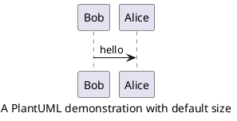
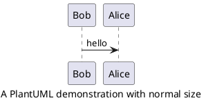
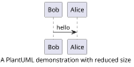
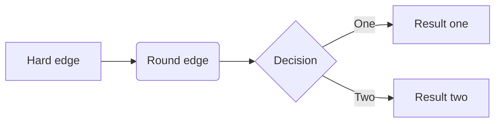
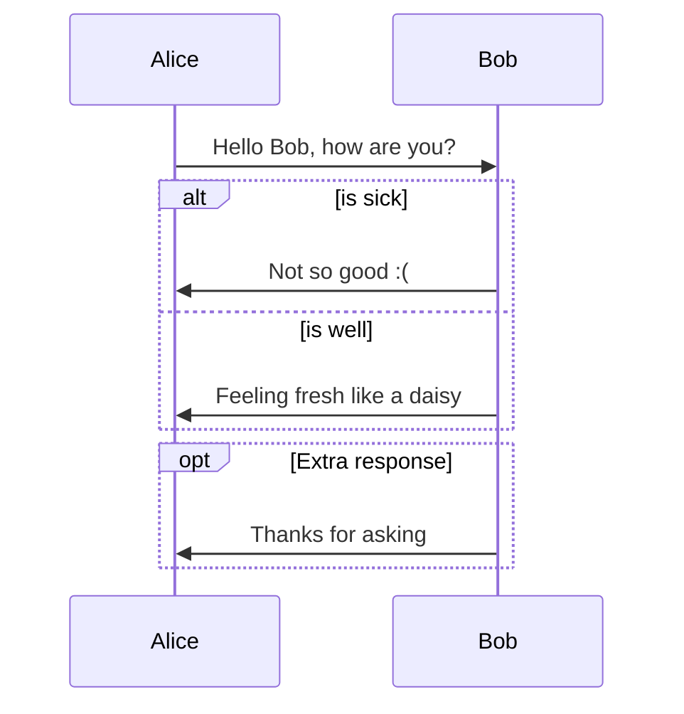

# Textual Diagrams

## PlantUML

```plantuml
@startuml
caption A PlantUML demonstration with default size
Bob->Alice : hello
@enduml
```

```plantuml
@startuml
caption A PlantUML demonstration with normal size
scale 1.0
Bob->Alice : hello
@enduml
```

```plantuml
@startuml
caption A PlantUML demonstration with reduced size
scale 0.5
Bob->Alice : hello
@enduml
```

## Mermaid

```mermaid
graph LR
A[Hard edge] -->B(Round edge)
    B --> C{Decision}
    C -->|One| D[Result one]
    C -->|Two| E[Result two]
```

```mermaid
%% Example of sequence diagram
  sequenceDiagram
    Alice->>Bob: Hello Bob, how are you?
    alt is sick
    Bob->>Alice: Not so good :(
    else is well
    Bob->>Alice: Feeling fresh like a daisy
    end
    opt Extra response
    Bob->>Alice: Thanks for asking
    end
```
